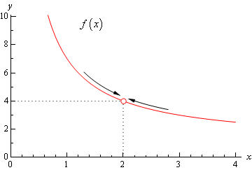

#Limits

##Introduction
Limits of a function **f(x)** are the points on a graph of **f** at which
it is not defined, but the points around the limits *point* in their direction.

##Example
The graph plotted on the image above is the one of function
f(x) = \frac{x^2+4x-12}{x^2-2x}

As it's clear from the image, the limit of *f* is at *x*=2.
To understand why, let's calculate *f(**2**)*:
f(2) = \frac{2^2+4\*2-12}{2^2-2\*2}
f(2) = \frac{0}{0}
f(2) = **?** (!)

So, it's impossible to find *f(2)*.
But it's also clear to us, looking at the graph, that the value that it's pointing to is 4.
Therefore, the neigbouring points should be close to 4.
And, indeed:
f(1.9) = 4.157
f(2.1) = 3.857

But notice that when we push these points closer to 2, they become less and less away from 4:
f(2.01) = 3.985
f(1.99) = 4.015

So basically, the **limit** is a **value at a point** at which a function **doesn't have** any **specific value**,
but by checking the **points closer and closer** to it, we get closer and closer to a **specific answer**.

##Definition
Now we only need to write the sentence above in a somewhat more *mathematically rigorous* manner!

So, first we need to define what *closer* means.

###Approaching
Let's consider the function f(x) = x.
We are sure that near the point **a** = 2, f(x) is also near 2.
So there can be a number **\gama**, say equal to **0.5**, such that it can for a range around 2 (from 1.5 to 2.5).
Now, there is a number **e** (epsilon) which forms a range of f(x) values which we get from x-es in the **\gama** range.

For our funtion *f* and **\gama** = 0.5, the values of *f(x)* also range from 1.5 to 2.5 and, therefore,
**e** = 0.5 .

But, for the funtion to approach some value within a certain range **e**, we must ensure that every point (every value of x) close enough (**\gama**) to **a**, leads us to a value within a range **e** of **l**.

A function can have climbs and drops and change it's values rapidly. This means that the **\gama** we chose needs to be chosen carefully.
Fortunately, we need only prove that a single **\gama** exists within which's range our funtion approaches it's limit (for any gama we choose).

###Approaching the limit
> The function **f approaches the limit l near a** means: for every e>0 [epsilon] there
> is some \gama>0 [gama] such that, for all x, if 0<\left|x-a\right|<\gama, then \left|f(x)-l\right|<e
- Spivak, "Calculus"

Notice that when approaching the limit, \left|f(x)-l\right| cannot be equal to epsilon (**e**), as that would mean that there is f(x) which is equal to the limit's value *l*.

###Notation
The above statement is writtena as:
\lim_{x \to a} f(x) = l

##Left and Right limit
A function can approach 2 different limits at the same point:
One that it approaches from the left,
And another from the right.
These are called the *right* and *left*-hand limits.

However, only when these are equal can a function have a limit (described by the definiton above).

##Excercises
1) \lim_{x \to 3} \frac{x^3-8}{x-2} = ?
2) \lim_{x \to 1} \frac{x+1}{x^(-1)+1} = ?
